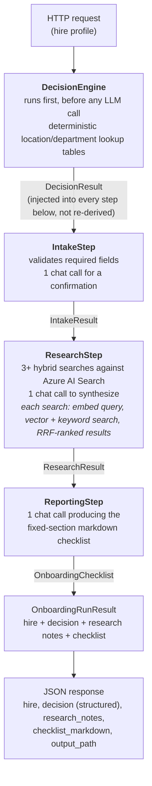

# DeskHand (Java/Azure)

A Java + Azure rebuild of [DeskHand](../deskhand): an AI onboarding assistant that combines
retrieval-augmented generation with agent-style orchestration and a role/location decision step.
The original is a Python/FastAPI project using Chroma, CrewAI, and the OpenAI API directly. This
project reimplements the **same architectural pattern** on Spring Boot, Azure AI Search, and Azure
OpenAI, built specifically to demonstrate that competency on a different stack, not to replace or
improve on the original as a product.

If you're comparing the two: the goal here is "same pattern, different stack," not "same code,
different language." Several pieces are deliberately reconsidered for Azure rather than
mechanically translated. Each one is called out below.

## Architecture at a glance



`OnboardingPipeline` is the one class that encodes this sequence: no framework, just typed method
calls where each step's output is the next step's input.

## Component mapping: original → this port

| Original (Python) | This port (Java/Azure) | Why |
|---|---|---|
| Chroma, local ONNX embeddings (`all-MiniLM-L6-v2`, vendored, zero API cost) | Azure AI Search + Azure OpenAI embeddings (`text-embedding-3-small`) | **Deliberate regression, not a transparent swap.** The original avoids any embedding API dependency entirely: offline, free, deterministic. This port trades that for managed infra: every embed call is now a network round-trip and a (small) metered cost, with new failure modes (rate limits, transient errors) that didn't exist before. Worth narrating directly in an interview: different constraints, different correct answers. |
| Pure vector search (`collection.query(n_results=4)`) | **Hybrid search** (BM25 keyword + vector, combined via RRF) | A deliberate improvement over the original, not required by the port: policy text has exact terms ("401k", "VPN") that benefit from keyword precision alongside semantic similarity, and Azure AI Search makes hybrid nearly free to add. |
| CrewAI `BaseTool` (`search_company_docs`), called by the Research agent's own reasoning | `SearchCompanyDocsTool`, called directly by `ResearchStep` in a loop | Preserves agent-driven retrieval without paying for an LLM tool-selection round-trip. The "≥3 searches" rule moves from agent judgment to explicit Java control flow: more deterministic and testable, a fair trade to call out as a simplification. |
| `crewai.LLM(model="gpt-4o-mini")`, OpenAI to DeepSeek to Kimi fallback chain | Spring AI `ChatModel`, single provider, deployment name in config | The multi-provider fallback chain is out of scope for this port's priorities; the model/deployment name staying config-driven preserves the "swap providers via config" pattern without the retry logic itself. |
| `Crew(process=Process.sequential)`, hand-off via `Task(context=[...])` (runtime-checked list) | `OnboardingPipeline` calling `IntakeStep` then `ResearchStep` then `ReportingStep`, hand-off via generic method signatures (`OnboardingStep<I, O>`) | No Java multi-agent framework fits this scope well (Spring AI has no `Crew` equivalent; adding LangChain4j on top of Spring AI would mean two LLM frameworks in one small project). The original's own CrewAI usage is already just "sequential steps, explicit typed hand-off" with delegation and shared memory turned off everywhere. Reproducing that exactly, with Java's type system enforcing the hand-off contract *at compile time* instead of CrewAI's runtime list, is a fair and honest match, not an under-build. |
| Intake / Research / Reporting **agents** (role, goal, backstory, tools) | Intake / Research / Reporting **steps** (`@Component` classes implementing `OnboardingStep<I,O>`) | Same three responsibilities, same narrow scope per stage, expressed as plain Spring beans instead of CrewAI `Agent` objects, since there's no delegation or agent-to-agent negotiation happening in either version. |
| Decision engine: **plain deterministic Python** (two lookup tables), explicitly *not* an LLM call | `DecisionEngine`: **plain deterministic Java** (two lookup tables) | **Ported as-is, unchanged in kind.** This is the one piece that should *not* become an LLM call: the original's own design rationale ("an LLM's discretion risks silently inconsistent results between runs") applies just as much in Java. Zero Azure/Spring AI dependencies; runs before the pipeline; its output is rendered verbatim in a "Why These Steps" section, never paraphrased by an LLM. |
| FastAPI routes | Spring `@RestController`s | `POST /api/onboarding/run`, `GET /api/sample-hires`, `GET /api/health` direct-map. The original's `/webhook/hris` endpoint is intentionally not built here, out of scope per this port's priorities. |
| React/Vite/Tailwind frontend | **The same frontend, reused** | Copied from the original almost unmodified; see [Frontend](#frontend) below for exactly what changed and why. |
| `.env` / `python-dotenv` | `application.yml` + `spring-dotenv` | Same pattern; see [Configuration](#configuration) below. |
| Offline test suite (fake embedder, no live API calls) | Same goal, Mockito fakes for `ChatService`/`SearchCompanyDocsTool` | CI never needs live Azure credentials or makes billable calls. |

## Why Azure App Service, not Azure Functions

The original takes 15-40 seconds per run (three sequential LLM calls plus retrieval). App Service's
long-lived process model comfortably covers that with a simple synchronous `POST -> response`
contract, matching the original's FastAPI behavior. Azure Functions' HTTP triggers risk
cold-start-plus-timeout issues on a JVM (one of the worse cold-start cases among Functions
runtimes), and Durable Functions, the actual fix for genuinely long-running work, would force an
async poll-for-status API shape, a materially worse fit for a curl/Postman-friendly demo, for a
workload that has exactly one execution path and no fan-out, human-wait, or event-driven need.
Functions would be the right call for a bursty, high-frequency, event-driven workload; this isn't
one.

## Stack

- **Java 21**, **Maven**
- **Spring Boot 4.1.x**, **Spring AI 2.0.x**. Note: Spring AI 2.0 discontinued its dedicated Azure
  OpenAI module. Azure access goes through Spring AI's generic OpenAI starter using its built-in
  ["Microsoft Foundry"](https://learn.microsoft.com/azure/ai-foundry/) (Azure OpenAI's current
  branding) support (`spring.ai.openai.microsoft-foundry=true` +
  `spring.ai.openai.{chat,embedding}.microsoft-deployment-name`, see `application.yml`), confirmed
  working end to end: a request made with a placeholder key reached Azure's real endpoint and got
  back Azure OpenAI's own regional-endpoint 401 error, not a connection failure, proving the
  request routing is genuinely correct.
- **Azure AI Search** (`azure-search-documents` 12.x, used directly rather than through a
  framework's vector-store abstraction, so the index schema and hybrid query construction are
  visible, explainable code) for hybrid retrieval
- **commonmark-java** for markdown parsing (H2-heading chunking, replicating the original's
  regex-based split)

## Project layout

```
src/main/java/com/deskhand/
├── decision/       deterministic location/department rules, zero Azure/Spring AI deps
├── rag/            Azure AI Search client, index schema, hybrid search tool
├── ingestion/       markdown chunking + one-shot indexing (java -jar app.jar --ingest)
├── llm/            thin wrappers over Spring AI's ChatModel/EmbeddingModel
├── orchestration/  the Intake -> Research -> Reporting pipeline
├── api/            REST controllers + DTOs
└── config/         externalized Azure/app configuration
docs/sample-policies/   the 4 sample policy docs (ported from the original's mock_docs)
frontend/               the original's React/Vite/Tailwind SPA, reused - see Frontend below
```

## Running locally

### Prerequisites
- Java 21, Maven (or use the included Docker setup)
- An Azure AI Search resource and an Azure OpenAI resource with a chat deployment (e.g.
  `gpt-4o-mini`) and an embedding deployment (e.g. `text-embedding-3-small`). There is no local
  emulator for either service, so local dev always talks to real (dev-tier) Azure resources for
  these two pieces.

### Configure
```bash
cp .env.example .env
# fill in AZURE_OPENAI_ENDPOINT, AZURE_OPENAI_API_KEY, AZURE_SEARCH_ENDPOINT, AZURE_SEARCH_API_KEY
```

### Run
```bash
mvn spring-boot:run
```
or with Docker:
```bash
docker compose up --build
```

### Seed the search index (once, before the API can find anything)
```bash
mvn spring-boot:run -Dspring-boot.run.arguments=--ingest
```
This chunks the 4 markdown docs under `docs/sample-policies/` by H2 heading, embeds each chunk via
the configured Azure OpenAI embedding deployment, and upserts them into the Azure AI Search index
(created automatically on first run).

### Try it
```bash
curl http://localhost:8080/api/sample-hires

curl -X POST http://localhost:8080/api/onboarding/run \
  -H "Content-Type: application/json" \
  -d '{"name":"Priya Nakamura","role":"Software Engineer II","department":"Engineering","location":"remote","start_date":"2026-09-15"}'
```
Or open `http://localhost:8080/` for a minimal HTML form that does the same thing, or run the full
React frontend (see [Frontend](#frontend) below) for the real demo experience.

### Tests
```bash
mvn test               # backend unit tests: decision engine, markdown chunker, pipeline (Mockito fakes for LLM/search)
mvn verify             # + the WebMvcTest-based controller test (Maven's *IT.java convention needs Failsafe, not Surefire)
cd frontend && npm test  # frontend component/hook tests (Vitest + Testing Library), copied from the original
```

## Frontend

`frontend/` is the original DeskHand frontend, copied over with the minimum changes needed to point
it at this Java backend instead of rewriting it:

- **The wire format, not the frontend, was adapted.** Rather than rewriting `DecisionLog`,
  `ResearchSources`, and `ChecklistView` to consume a Java-idiomatic camelCase JSON shape,
  `OnboardingResponse` on the Java side deliberately mirrors the original Python backend's exact
  response contract - snake_case field names (`start_date`, `location_track`, `dept_track`,
  `research_notes`, `checklist_markdown`) via explicit `@JsonProperty` annotations, and the same
  nested shape (`{hire, decision, research_notes, checklist_markdown, output_path}`). This means
  the components themselves needed almost no changes.
- **`decision` is returned as structured data**, not just markdown - `DecisionLog` renders it as
  two separate track cards (location/department) with badges and step lists, so the API exposes
  `DecisionResult` directly (`OnboardingResponse.DecisionView`) rather than only the rendered
  markdown. `checklist_markdown` still includes the decision log appended as text too, matching the
  original exactly (so it appears both as a structured card and as raw text - that's not a bug,
  it's what the original does).
- **`output_path` is always `null`** - this deployment is stateless (Azure App Service), unlike the
  original which persists the checklist to a local file. `ChecklistView` was adjusted to show a
  different caption when the path is absent instead of assuming one always exists.
- **CORS is wide open on `/api/**`** (`WebConfig`), matching the original's own
  `allow_origins=["*"]` and its "portfolio demo only" comment - not something to keep as-is for a
  real production API.
- A handful of UI strings referencing "crew" (CrewAI terminology) and hardcoded port 8000 were
  updated to "pipeline" and 8080 respectively; everything else - components, styling, tests - is
  the original, unchanged.

### Running the frontend
```bash
cd frontend
npm install
npm run dev
```
Vite's dev server proxies `/api` to `http://localhost:8080` (see `frontend/vite.config.ts`), so
requests are same-origin from the browser's perspective - no CORS involvement in local dev. Start
the backend first (previous section) so there's something for the proxy to reach.

## Configuration

Every Azure-specific value is externalized via environment variables (see `.env.example`); none
are hardcoded. `spring-dotenv` loads a local `.env` file for `mvn spring-boot:run`; in Azure App
Service, the same variable names become real App Settings instead. Note: `spring-dotenv` ships no
Spring auto-configuration file, so its initializer is registered explicitly in
`DeskhandApplication.main()`, confirmed by inspecting the dependency's jar, not assumed.

## Deploying to Azure

`infra/main.bicep` provisions an App Service Plan + Web App on the Java SE runtime (running the
built jar directly - no container or registry needed) with app settings wired to the same
environment variables as local dev. It does **not** provision the Azure OpenAI or Azure AI Search
resources themselves - those need a couple of manual steps first (an Azure OpenAI resource needs
model *deployments* created inside it, which isn't a clean fit for a single reusable Bicep
parameter set at this project's scale):

1. Create an Azure OpenAI resource (portal or `az cognitiveservices account create`), then create a
   chat deployment (e.g. `gpt-4o-mini`) and an embedding deployment (e.g. `text-embedding-3-small`)
   inside it. Note: some subscriptions start with 0 quota for a given model/region and need a quota
   increase request before deployment creation succeeds.
2. Create an Azure AI Search resource (`az search service create`) - the Free tier is enough for
   this project's 4 sample documents.
3. Run the commands below, filling in both resources' endpoint/key into
   `infra/main.parameters.json`.

```bash
# One-time: verify the exact Java 21 runtime string before deploying - see the flagged comment
# at the top of infra/main.bicep for why this specific value isn't fully confirmed.
az webapp list-runtimes --os linux | grep JAVA

# Provision the resources
cp infra/main.parameters.example.json infra/main.parameters.json
# edit infra/main.parameters.json with your real Azure OpenAI / AI Search values (gitignored)
az group create --name deskhand-variant-rg --location eastus
az deployment group create \
  --resource-group deskhand-variant-rg \
  --template-file infra/main.bicep \
  --parameters infra/main.parameters.json

# Deploy the app
mvn -DskipTests package
az webapp deploy \
  --resource-group deskhand-variant-rg \
  --name deskhand-variant \
  --src-path target/deskhand-variant.jar \
  --type jar
```

This was validated with `az bicep build` (compiles clean) and `az bicep lint` (no warnings), but
**not against a real Azure subscription** - there's no Azure login in this environment. Treat it as
correct-on-paper infrastructure-as-code, not as deployed-and-confirmed-working.

## Known gaps / things to verify before treating this as production-ready

- **Verified so far**: backend compiles, boots, and all 11 backend tests + 32 frontend tests pass;
  the frontend was run for real against the live backend (Vite's dev-server proxy correctly forwarding
  `/api/health` and `/api/sample-hires` through to Spring Boot on 8080); a request with a placeholder
  Azure OpenAI key reached Azure's real endpoint and got Azure's own 401 back (see Stack, above).
- **Real end-to-end run not yet exercised.** Everything has been verified to compile, boot, and
  correctly route requests to real Azure endpoints (confirmed via the 401 test above), but no
  ingestion or query has run against a real Azure AI Search index with a real Azure OpenAI key yet;
  do that before relying on retrieval quality.
- **Azure AI Search vector/hybrid query API was verified against the resolved 12.0.1 SDK jar**
  directly (via `javap`), not assumed from documentation, since this SDK line moved from a 11.x
  generic-POJO document model to a from-scratch `Map<String,Object>`-based one in 12.x. Re-check if
  you bump the SDK version.
- **Embedding dimensionality** (`AZURE_OPENAI_EMBEDDING_DIMENSIONS`, default 1536) must match your
  actual embedding deployment's output size, or the Azure AI Search index will need to be recreated.
- **The Bicep deployment config's exact `linuxFxVersion` for Java 21 is unconfirmed** (see
  [Deploying to Azure](#deploying-to-azure)) - verify with `az webapp list-runtimes` before your
  first real deployment. No GitHub Actions CI/CD workflow exists yet either - deployment is
  currently a manual `az` command sequence.
